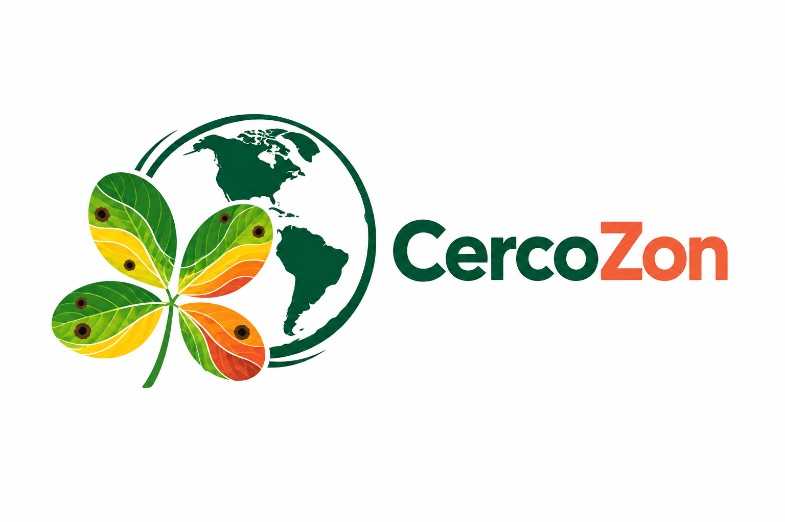
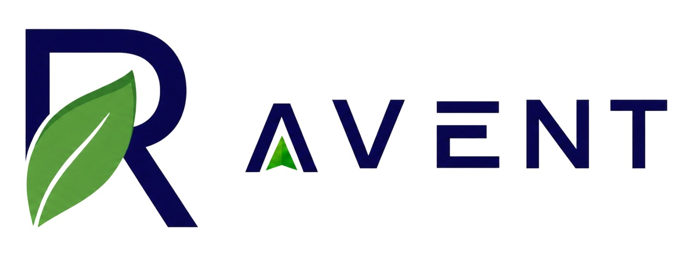
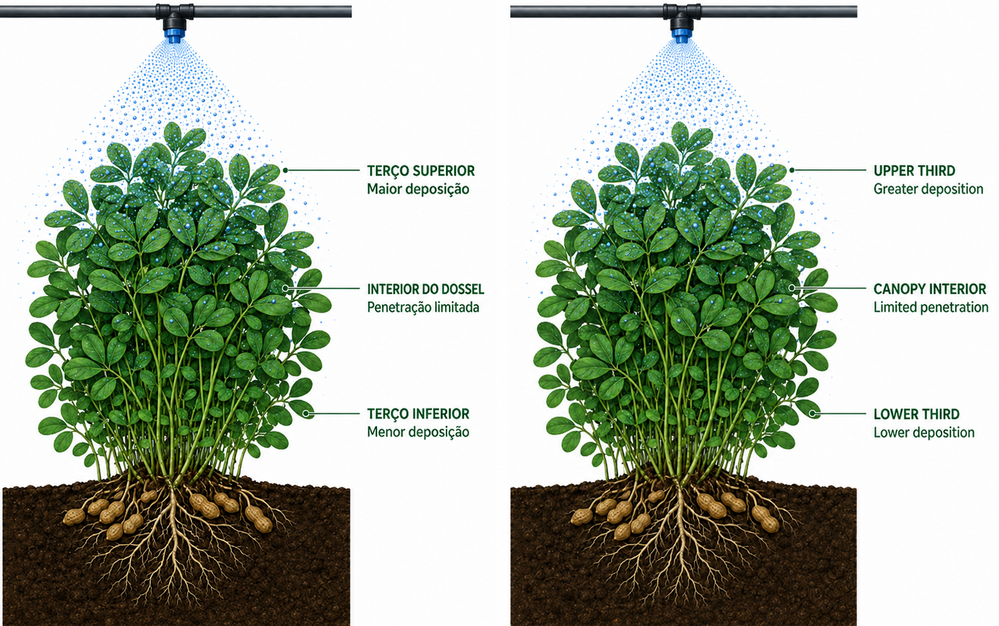
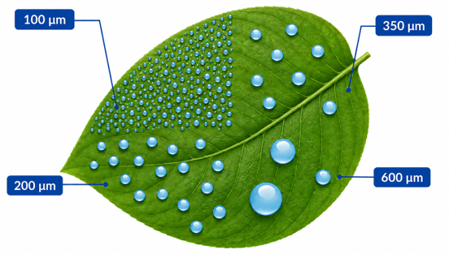
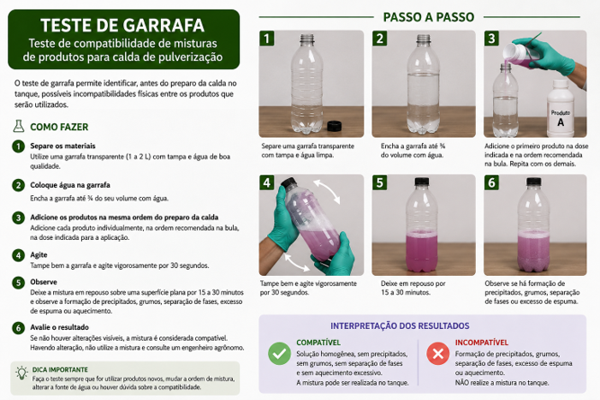
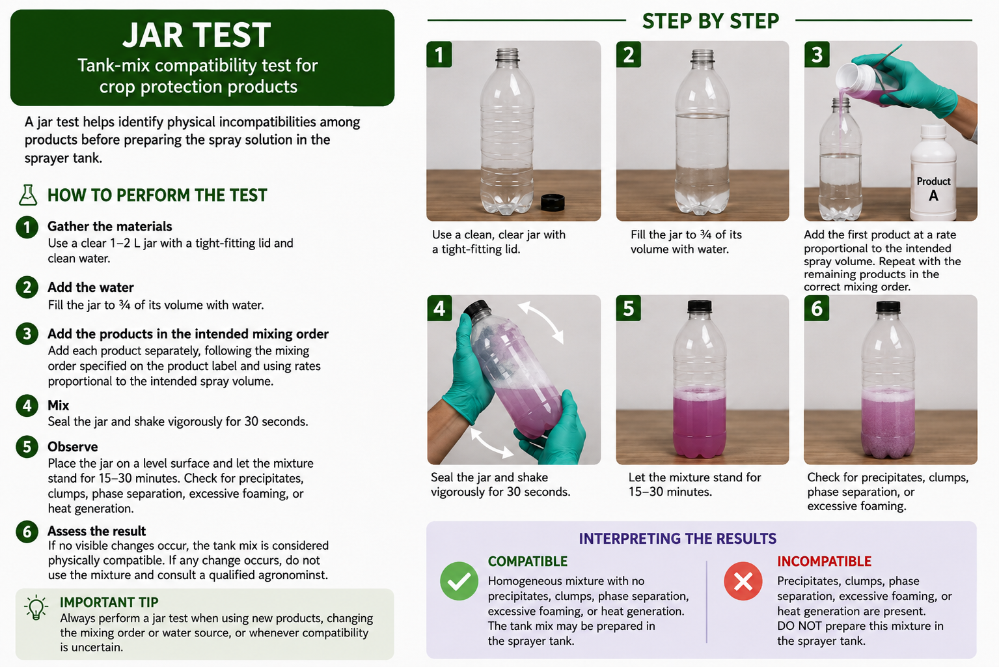

# Static Assets

This directory contains the static visual assets used by **CercoZon**, an R Shiny web application developed for climate risk zoning of the peanut leaf spot complex in selected peanut-producing states of Brazil and the United States.

## Application Logo

| Logo | File | Description |
|------|------|-------------|
|  | `CercoZon.png` | Official CercoZon logo |

The CercoZon logo represents the main components of the application: peanut leaf spot symptoms, climate risk classification, and the geographical scope of the study in Brazil and the United States.

## Institutional and Research Group Logos

| Logo | File | Description |
|------|------|-------------|
|  | `Bastos_Lab.png` | Bastos Laboratory, University of Georgia |
|  | `LAMMA.png` | Laboratory of Agricultural Machinery and Mechanization |
|  | `RSRG.png` | Research Support and Resources Group |
|  | `UGA.png` | University of Georgia |
|  | `Unesp_Jaboticabal.jpg` | São Paulo State University (Unesp), School of Agricultural and Veterinary Sciences, Jaboticabal campus |
|  | `cbioclima.jpg` | CBIClima Research Center |
|  | `Ravent_logo.jpeg` | Ravent logo |

## Application Figures

The following figures support the presentation of concepts and procedures within the dashboard:

| Preview | File |
|---------|------|
|  | `Figure1.png` |
|  | `Figure2.png` |
|  | `Figure3.jpg` |
|  | `Figure3.1.jpg` |
|  | `Figure4.png` |
|  | `Figure4.1.png` |

## Country Icons

| Icon | File | Description |
|------|------|-------------|
|  | `brasil.png` | Brazil country icon |
|  | `estados-unidos.png` | United States country icon |

## Usage and Licensing

These assets are used exclusively in the CercoZon dashboard and its associated documentation. Institutional logos remain the property of their respective organizations and may be subject to separate usage and licensing policies.
